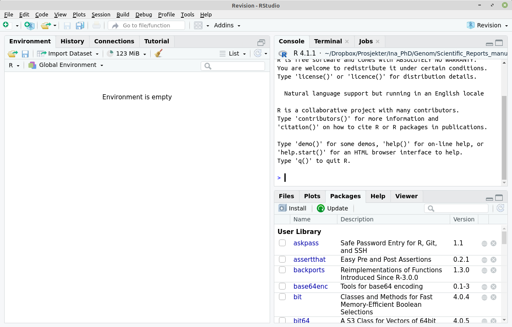

# BIOS-IN5410
Repository for the R lectures in BIOS-IN5410

NB: The contents and information here may change frequently. Make sure you see the latest updates.  

## Get started
Before the lectures, make sure that you have R and RStudio installed and working on your computer. You should first download and install R, for instance from [cran.uib.no](https://cran.uib.no/). Then you should download and install RStudio from [rstudio.com](https://www.rstudio.com/products/rstudio/download/) (make sure you choose the right operating system).  

**NB!** If you have a computer owned by your university with a windows operating system it's a good idea to have your IT department install R and RStudio. And very important: make sure that R-packages will be installed locally and not on any remote drive (e.g. by changing the default `.libPaths()`).

When you have everything up and running it should look something like this:
  

  
  
  ## Resources
  Here are some nice resources for learning to program with R and RStudio:  
  [Software Carpentry R for Reproducible Scientific Analysis](https://swcarpentry.github.io/r-novice-gapminder/)  
  [R Ladies Sydney RYouWithMe?](https://rladiessydney.org/courses/ryouwithme/)  
  [R for Data Science](https://r4ds.had.co.nz/index.html)  
  [Modern Statistics for Biology](https://web.stanford.edu/class/bios221/book/index.htm)
